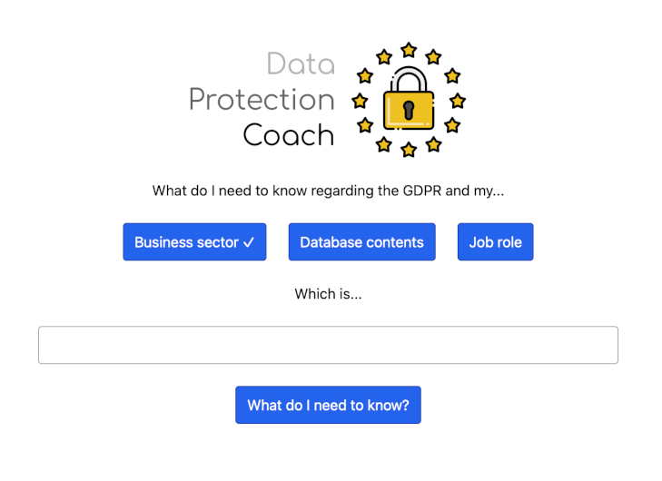

# Data Protection Coach

A project implementing a simple AI startup idea to help businesses achieve GDPR compliance. Used for my talk on startup building.



## Prerequisites

Before you begin, ensure you have met the following requirements:

- [Node.js](https://nodejs.org/) installed on your machine. The project has been developed and tested with Node.js version 18.6.0. You can download the latest version of Node.js from [https://nodejs.org/](https://nodejs.org/).

### Verifying Node.js Installation

To check if Node.js is installed, open a command prompt or terminal window and run the following commands:

```bash
node --version
```

This should display the installed Node.js version. Additionally, you can check the npm version:

```bash
npm --version
```

Make sure both commands return valid version numbers.

### Installing Visual Studio Code (Recommended)

Visual Studio Code is the recommended code editor for this project. Follow these steps to install it:

1. Visit the [Visual Studio Code website](https://code.visualstudio.com/).
2. Download the installer for your operating system (Windows, macOS, or Linux).
3. Run the installer and follow the on-screen instructions.
4. After installation, open Visual Studio Code.

## Installing Dependencies

Once Node.js is installed, navigate to the project's root directory using the command line and run the following command to install the project dependencies:

```bash
npm install
```

This will download and install the necessary packages specified in the `package.json` file.

## Setting Up Environment Variables

Your app needs to be able to connect to a database as well as the OpenAI API in order to function. If you're in class, your teacher can provide these to you if you don't have them to hand. Otherwise you'll need to set up a database (e.g. using [Railway](https://docs.railway.app/guides/mysql)) and [register your own OpenAI API key](https://platform.openai.com/docs/quickstart?context=python).

1. **Database Connection (DATABASE_URL):**
   - Copy the file called `.env.example` a new file named `.env` in the root directory of your project.
   - Inside the `.env` file, add the following line and replace `<YOUR_DATABASE_URL>` with the actual connection URL for your database:

     ```env
     DATABASE_URL="<YOUR_DATABASE_URL>"
     ```

   - Save the `.env` file.

2. **OpenAI API Key (OPENAI_API_KEY):**
   - This project makes use of the OpenAI API, which requires an API key. To install it, add another line to your `.env` file:

     ```env
     OPENAI_API_KEY="<YOUR_API_KEY>"
     ```

   - Replace `<YOUR_API_KEY>` with your actual OpenAI API key.

   - Save the `.env` file.

## Running the Project

After installing the dependencies, you can run the project using the following command:

```bash
npm start
```

This will start the application, and you can access it by navigating to [http://localhost:3000](http://localhost:3000) in your web browser.

## Deploying on Vercel (Optional)

If you wish to deploy your project on Vercel, an easy-to-use platform for hosting web applications, follow this [Vercel deployment tutorial](https://vercel.com/docs/platform/deployments). If you're in class, there's no need to do this unless you actually want to take things further outside the classroom by opening your app up to real users!
